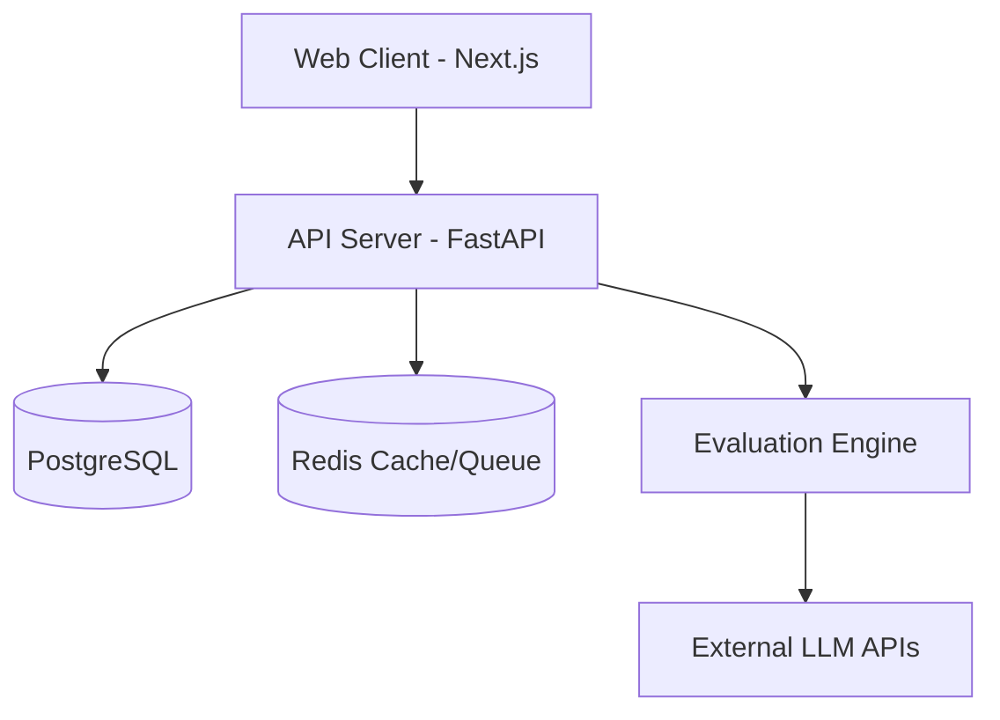

# System Architecture

## Overview
CF Benchmark is designed as a modern, decoupled monorepo application.

## Components
1. **Frontend**: Next.js application for users to view benchmark runs and configure scenarios.
2. **Backend API**: Python FastAPI providing RESTful endpoints.
3. **Database**: PostgreSQL for storing scenarios, rubrics, runs, and results.
4. **Task Queue**: Redis-backed queue for asynchronous evaluation processing.
